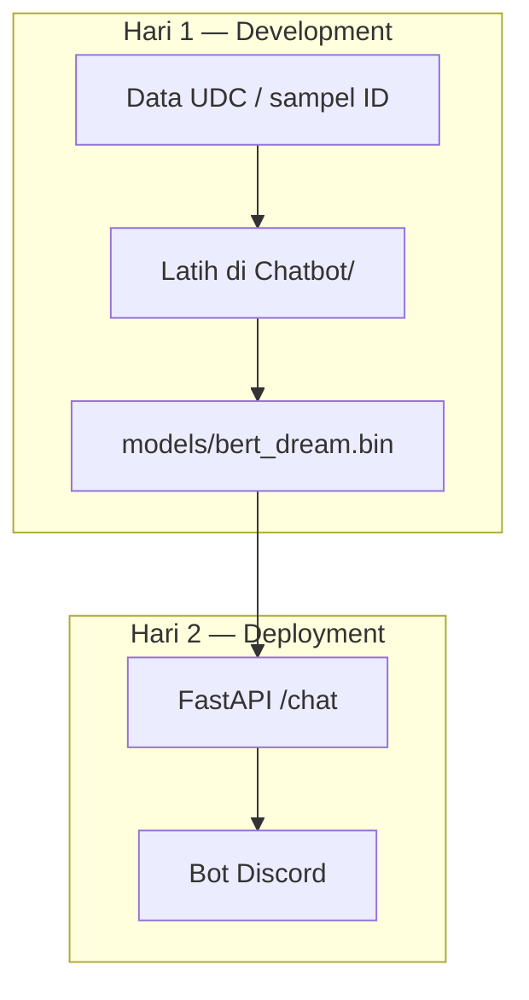

# Demo-day — Chatbot NLP (2 Hari)

**Mata kuliah:** Pemrosesan Bahasa Alami Berbasis Transformer  
**Program Studi Sains Data · Fakultas Sains · Institut Teknologi Sumatera**

Paket presentasi **dua sesi**: latih model (hari 1) lalu deploy ke **FastAPI + Discord** (hari 2).

---

## Jadwal presentasi

| Hari | Folder | Fokus | Panduan |
|------|--------|-------|---------|
| **Hari 1** | [`day-1-development/`](day-1-development/) | Data UDC, latih BERT/Transformer, checkpoint | [README Hari 1](day-1-development/README.md) |
| **Hari 2** | [`day-2-deployment/`](day-2-deployment/) | FastAPI, bot Discord, demo live | [README Hari 2](day-2-deployment/README.md) |

**Antara hari 1 dan 2:** pastikan file checkpoint sudah ada di `models/` (lihat checklist di akhir panduan hari 1).

---

## Topik & dataset

**Chatbot helpdesk teknis** — dataset open source: [Ubuntu Dialogue Corpus (UDC)](https://github.com/rkadlec/ubuntu-ranking-dataset-creator).

| Model | Folder latih | Checkpoint |
|-------|--------------|------------|
| **BERT** | [`Chatbot/Bert_chatbot/`](../Chatbot/Bert_chatbot/) | `models/bert_dream.bin` |
| **Transformer** | [`Chatbot/transformer_chatbot/`](../Chatbot/transformer_chatbot/) | `models/chatbot-v2.pt` + `models/vocab.pkl` |

---

## Struktur folder

```
Demo-day/
├── README.md                      ← Anda di sini
├── requirements.txt               ← dependensi lengkap (hari 1 + 2)
├── .env.example                   ← terutama hari 2 (Discord + API)
├── models/                        ← checkpoint bersama (hari 1 → hari 2)
├── day-1-development/
│   ├── README.md                  ← Panduan + slide outline hari 1
│   ├── data/
│   └── scripts/
└── day-2-deployment/
    ├── README.md                  ← Panduan + slide outline hari 2
    ├── backend/                   ← FastAPI
    └── discord_bot/
```

---

## Alur dua hari



---

## Setup sekali (sebelum hari 1)

```bash
cd Demo-day
python3 -m venv .venv && source .venv/bin/activate
pip install -r requirements.txt
```

Hari 2 tambahan: `cp .env.example .env` dan isi `DISCORD_TOKEN`.

---

## Kredit

- Modul latih: [shawroad/NLP_pytorch_project](https://github.com/shawroad/NLP_pytorch_project) — `Chatbot/`
- Dataset: [Ubuntu Ranking Dataset Creator](https://github.com/rkadlec/ubuntu-ranking-dataset-creator)
