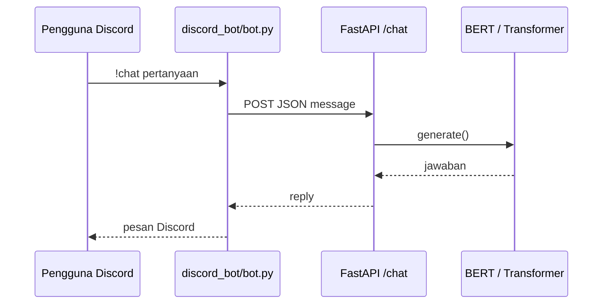

# Hari 2 — Deployment

**Demo-day · Sesi 2 dari 2**  
**Prasyarat:** Checkpoint dari [Hari 1](../day-1-development/README.md) ada di `Demo-day/models/`.

Pada hari ini Anda menjalankan **FastAPI** sebagai backend inferensi, lalu menghubungkannya ke **bot Discord** untuk demo percakapan live.

> **Kemarin:** data + latih model — [`../day-1-development/README.md`](../day-1-development/README.md).

---

## Prasyarat (cek sebelum presentasi)

- [ ] `Demo-day/models/bert_dream.bin` (atau artefak Transformer)  
- [ ] File `Chatbot/Bert_chatbot/data/vocab.txt` dan `pytorch_model.bin`  
- [ ] Lingkungan Python: `pip install -r ../requirements.txt`  
- [ ] Akun Discord + aplikasi bot sudah dibuat (bisa malam sebelumnya)

---

## 1. Konfigurasi lingkungan

```bash
cd Demo-day
cp .env.example .env
```

Edit `.env`:

```env
MODEL_TYPE=bert
DISCORD_TOKEN=your_bot_token_here
API_URL=http://127.0.0.1:8000
```

| Variabel | Arti |
|----------|------|
| `MODEL_TYPE` | `bert` atau `transformer` |
| `DISCORD_TOKEN` | Token dari [Discord Developer Portal](https://discord.com/developers/applications) |
| `API_URL` | URL FastAPI (tanpa `/` di akhir) |
| `BOT_PREFIX` | Default `!` → perintah `!chat` |
| `MENTION_ONLY` | `true` = hanya jawab saat di-mention |

Checkpoint (path relatif ke root `Demo-day/`):

| Variabel | Default |
|----------|---------|
| `BERT_CHECKPOINT` | `models/bert_dream.bin` |
| `TRANSFORMER_CHECKPOINT` | `models/chatbot-v2.pt` |
| `TRANSFORMER_VOCAB` | `models/vocab.pkl` |

---

## 2. Backend FastAPI

Detail API: [`backend/README.md`](backend/README.md)

**Terminal 1:**

```bash
cd Demo-day/day-2-deployment
source ../.venv/bin/activate   # jika venv di root Demo-day
export MODEL_TYPE=bert
# Muat .env dari root Demo-day (opsional):
export $(grep -v '^#' ../.env | xargs) 2>/dev/null || true

uvicorn backend.app.main:app --host 0.0.0.0 --port 8000 --reload
```

Uji di browser: http://127.0.0.1:8000/docs

**Terminal lain — curl:**

```bash
curl -s http://127.0.0.1:8000/health
curl -s -X POST http://127.0.0.1:8000/chat \
  -H "Content-Type: application/json" \
  -d '{"message": "WiFi kampus tidak bisa connect"}'
```

---

## 3. Bot Discord

### Buat aplikasi bot

1. [Discord Developer Portal](https://discord.com/developers/applications) → **New Application**.
2. Tab **Bot** → **Add Bot** → salin token ke `.env`.
3. Aktifkan **Message Content Intent** (Privileged Gateway Intents).
4. **OAuth2** → URL Generator: scope `bot`, permission **Send Messages** + **Read Message History**.
5. Buka URL undangan; tambahkan bot ke server uji kelas.

### Jalankan bot

**Terminal 2** (API di terminal 1 harus tetap jalan):

```bash
cd Demo-day/day-2-deployment
source ../.venv/bin/activate
python3 discord_bot/bot.py
```

### Percakapan di Discord

- `!chat WiFi tidak bisa connect`  
- `@NamaBot password portal lupa`

---

## 4. Diagram arsitektur (untuk slide)



---

## 5. Produksi ringan (opsional)

| Komponen | Saran |
|----------|--------|
| API | `uvicorn` di laptop lab; satu worker cukup untuk demo |
| Bot | `screen` / PM2 menjalankan `bot.py` |
| Jarak mesin | Jika API di VM, set `API_URL=http://IP_VM:8000` di `.env` |

---

## Checklist penutup Hari 2

- [ ] `/health` → `"model_loaded": true`  
- [ ] `curl /chat` mengembalikan jawaban masuk akal  
- [ ] Bot online (hijau) di Discord  
- [ ] Demo `!chat` + mention berhasil di depan kelas  
- [ ] Screenshot percakapan untuk laporan  

---

## Troubleshooting

| Gejala | Solusi |
|--------|--------|
| `Checkpoint BERT tidak ditemukan` | Salin ulang dari Hari 1 ke `Demo-day/models/` |
| `503 Model belum siap` | Restart API; cek log saat startup |
| Bot tidak menjawab | Message Content Intent; cek `MENTION_ONLY` |
| `Connection refused` | Jalankan uvicorn dari `day-2-deployment/` |
| Import error `backend` | Working directory harus `day-2-deployment/` saat `uvicorn` |

---

## Keamanan

- Jangan commit `.env` atau token.  
- Gunakan server Discord khusus uji, bukan server produksi kampus.
