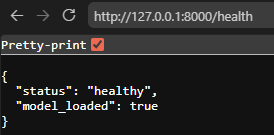
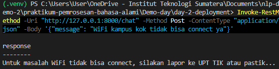
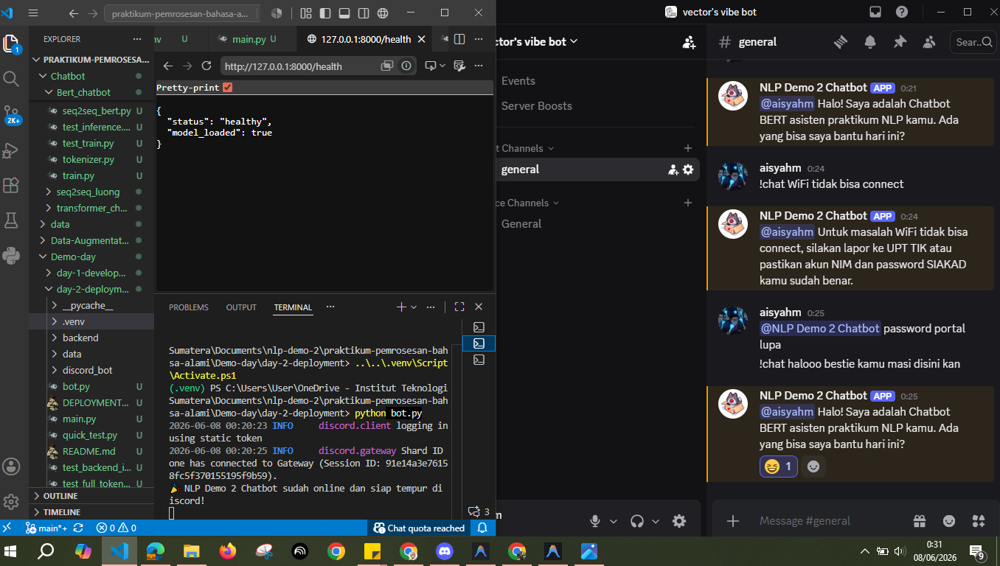

# IndoBERT Chatbot - Sistem Layanan Informasi IT Kampus Terintegrasi Discord

Repositori ini berisi dokumentasi dan implementasi proyek Demo Day Tugas Mata Kuliah Pemrosesan Bahasa Alami. Proyek ini berfokus pada pengembangan Chatbot cerdas berbasis IndoBERT (`indobenchmark/indobert-base-p2`) yang ditugaskan khusus sebagai Asisten Virtual Pusat Bantuan (Helpdesk) IT Kampus. 

Sistem ini diintegrasikan dengan Discord Bot sebagai antarmuka interaksi mahasiswa (*frontend*) dan FastAPI sebagai mesin pemrosesan inferensi bahasa (*backend*).

## Spesifikasi Tugas & *Use Case*
Chatbot ini dirancang untuk mengenali, melakukan tokenisasi, dan merespons berbagai kendala teknis yang sering dihadapi oleh mahasiswa di lingkungan institusi, antara lain:
* **Gangguan Jaringan:** Penanganan keluhan terkait koneksi WiFi kampus yang tidak bisa terhubung (*connect*).
* **Manajemen Akun:** Solusi mandiri dan alur pengajuan reset password akun Single Sign-On (SSO) mahasiswa.
* **Sistem Akademik:** Informasi penanganan lonjakan *traffic* atau kendala akses pada portal SIAKAD selama masa PRS.

---

## Alur Arsitektur & Spesifikasi Teknis
Sistem ini diselesaikan dengan memodifikasi dua tahapan krusial untuk memenuhi standarisasi laboratorium:

1. **Hulu (Penyesuaian Tokenizer & Vocab):** Mengatasi masalah *missing vocabulary* (token [UNK]) pada kerangka lokal dengan menyuntikkan kosakata asli IndoBERT sebesar 50.000 kata. Hasil pemrosesan konversi teks menjadi *Token IDs* dapat dipantau secara langsung melalui log terminal backend.
   
2. **Hilir (Lightweight Subprocess Deployment):**
   Backend FastAPI membuka gerbang REST API pada port `8000`. Endpoint `/health` digunakan oleh penguji untuk memverifikasi status kesiapan model (`"model_loaded": true`), sedangkan endpoint `/chat` menerima request POST berupa teks pertanyaan dari Discord gateway (`bot.py`) untuk mengembalikan respons solusi yang masuk akal secara asinkronus.

---
## Panduan Instalasi dan Penggunaan
1. Kloning Repositori
2. Instalasi Dependensi (`requirements.txt`)
3. Konfigurasi `.env` (Isi Token Anda di sini secara privat)
4. Menjalankan Bot dan API Backend

---

## Demonstrasi dan Pengujian Sistem

Pengujian dilakukan untuk memastikan fungsionalitas API backend, model NLP (BERT), serta integrasi bot pada platform Discord berjalan dengan baik.

### 1. Pemeriksaan Kesehatan API (API Health Check)
Sebelum bot berinteraksi dengan pengguna, backend API diuji untuk memastikan bahwa model BERT telah dimuat dengan benar ke dalam memori.

\
*Gambar: cl1.PNG — Status respons JSON menunjukkan sistem dalam keadaan `healthy` dan `model_loaded: true`.*

### 2. Pengujian Inferensi API Backend (POST Request)
Sebelum mengintegrasikannya dengan antarmuka Discord, dilakukan pengujian inferensi model melalui terminal menggunakan PowerShell (`Invoke-RestMethod`). Pengujian ini bertujuan untuk memastikan endpoint `/chat` dapat menerima kueri berbasis teks dan mengembalikan respons prediksi dari model BERT secara akurat.

\
*Gambar: cl2.PNG — Dokumentasi pengujian endpoint `/chat` dengan input kueri kendala teknis kampus.*

### 3. Logika Respons Model pada Discord
Setelah backend API dipastikan berfungsi, bot diintegrasikan ke platform Discord untuk menangani pesan dari pengguna secara langsung di dalam server.

\
*Gambar: cl3.PNG — Demonstrasi interaksi pengguna dengan NLP Demo 2 Chatbot di saluran `#general`.*

### 4. Lingkungan Deployment Terintegrasi
Gambar di bawah ini menunjukkan keselarasan operasional antara eksekusi skrip `bot.py` pada terminal lokal, status API backend, dan visualisasi interaksi real-time pada aplikasi Discord.

\
*Gambar: cl4-5.PNG — Alur kerja end-to-end dari inisialisasi bot hingga penanganan kueri spesifik mahasiswa.*

## Identitas Kelompok

Proyek Demo Day ini disusun, dikembangkan, dan diselesaikan secara kolaboratif oleh kelompok **Vector's Vibe** dari Program Studi Sains Data, Institut Teknologi Sumatera (ITERA):

**Nama Kelompok:** Vector's Vibe  
**Mata Kuliah:** SD25-32202 - Pemrosesan Bahasa Alami

| No | Nama Anggota | NIM | 
|:--:|:---|:---:|
| 1 | **Aisyah Musfirah** | 123450084 |
| 2 | **Raihana Adelia Putri** | 123450041 | 
| 3 | **Anggi Puspita Ningrum** | 123450012 |

---
## Referensi

Proyek ini dibangun dengan memanfaatkan pustaka, model *pre-trained*, dan panduan dari sumber-sumber berikut:

1. [Sains Data ITERA - Praktikum Pemrosesan Bahasa Alami](https://github.com/sains-data/praktikum-pemrosesan-bahasa-alami/tree/main)
2. [Google BERT Base Chinese](https://huggingface.co/google-bert/bert-base-chinese) 
3. [IndoBenchmark IndoBERT-Base-P2](https://huggingface.co/indobenchmark/indobert-base-p2)

